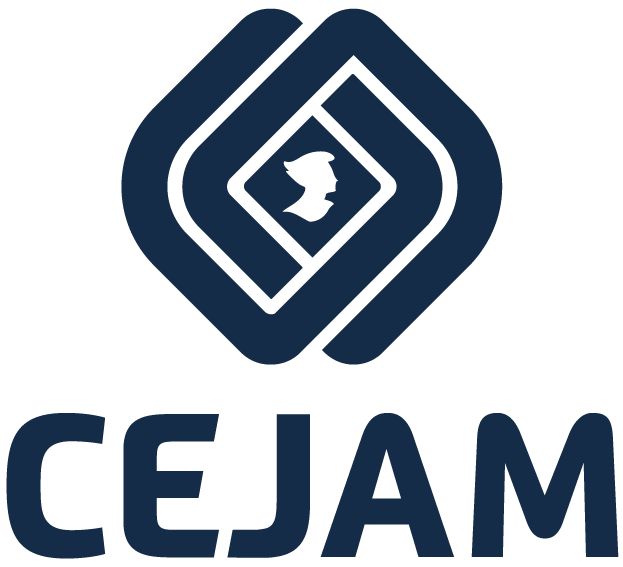

<div align="center">
  
  <h1>Ferramenta de Controle de Ativos</h1>
  <p><strong>Desafio Técnico Full Stack - CEJAM</strong></p>
</div>

---

## Resumo do Projeto

Este projeto é uma **Ferramenta de Controle de Ativos** desenvolvida como parte do desafio técnico para uma vaga Full Stack no **CEJAM**. 

O sistema foi desenhado para resolver um problema cotidiano em um pequeno escritório: substituir o controle de equipamentos compartilhados (como monitores, teclados e projetores), anteriormente feito por planilhas sujeitas a falhas e perdas, por uma aplicação web moderna, responsiva e segura.

Através deste sistema, administradores podem cadastrar, listar e gerenciar o empréstimo (check-out) e a devolução (check-in) de equipamentos de forma eficiente.

## O Desafio Técnico

O objetivo do desafio era construir uma aplicação "Full Stack" robusta que contemplasse tanto o backend quanto o frontend, aderindo às melhores práticas do mercado. O sistema precisava implementar o **Caso de Negócio 1 (Ferramenta de Controle de Ativos)**.

As exigências incluíam:
- **Backend**: Desenvolver uma API em .NET 8 utilizando SQLite e Entity Framework Core, com separação clara de responsabilidades (Controllers e Services), respostas JSON e códigos HTTP adequados.
- **Frontend**: Uma SPA reativa construída com Next.js, React e TypeScript, focada em componentes reutilizáveis, gerenciamento de estado sem recarregar a página e design responsivo.
- **Diferenciais Implementados**: Containerização da aplicação usando Docker e Docker Compose para facilitar a orquestração e execução local.

## Tecnologias Utilizadas

**Backend:**
- **.NET 8 (C#)**
- **Entity Framework Core**
- **SQLite** (Banco de dados relacional leve e embutido)
- **Padrões de Projeto**: Camadas de Serviços, Injeção de Dependência, DTOs

**Frontend:**
- **Next.js & React**
- **TypeScript**
- **CSS Modules / Vanilla CSS**
- **React Hot Toast** (para notificações visuais)
- **React Icons**

**Infraestrutura:**
- **Docker**
- **Docker Compose**

## Regras de Negócio e Funcionalidades

O sistema foi modelado em torno do rastreamento do ciclo de vida de ativos físicos:

1. **Cadastrar um Ativo:**
   - Todo equipamento deve ser registrado com um nome e um **Código de Identificação único**.
2. **Listagem em Tempo Real:**
   - Exibição de todos os ativos cadastrados e seus respectivos status atuais: `Disponível` ou `Em uso`.
3. **Check-out (Realizar Empréstimo):**
   - Apenas equipamentos com o status `Disponível` podem ser emprestados. Ao realizar o check-out, o sistema marca o item como `Em uso` e vincula o usuário/setor solicitante, juntamente com a data do empréstimo.
4. **Check-in (Registrar Devolução):**
   - O item retorna ao status `Disponível`. O sistema registra a data de devolução, encerrando o ciclo do empréstimo daquele equipamento.
5. **Remover Ativo (Soft Delete / Inativação):**
   - Caso um equipamento seja danificado, perdido ou aposentado, ele pode ser removido logicamente da listagem, sem que os históricos de empréstimos antigos associados a ele sejam perdidos no banco de dados.

## Como Rodar Localmente (Docker Compose)

Graças ao uso do Docker, a execução do projeto localmente foi simplificada para exigir apenas um comando. Não é necessário ter o .NET, Node.js ou SQLite instalados diretamente na sua máquina; o Docker cuida de tudo!

### Pré-requisitos
- Ter o [Docker](https://www.docker.com/products/docker-desktop/) e o **Docker Compose** instalados.

### Passos para execução:

1. Clone o repositório para a sua máquina:
   ```bash
   git clone <URL_DO_REPOSITORIO>
   cd projetoassets
   ```

2. Na raiz do projeto (onde está o arquivo `docker-compose.yml`), execute:
   ```bash
   docker compose up --build -d
   ```

3. O que acontece em seguida?
   - O contêiner do `db` vai ser inicializado criando a pasta persistente e o volume pro banco SQLite.
   - A `API` vai ser construída em um contêiner baseado no SDK do .NET 8, publicando a versão de runtime e se conectando ao banco de dados no volume. Ela também vai rodar automaticamente as migrações (EF Core) garantindo que as tabelas estejam criadas.
   - O `Frontend` será construído e servido em uma instância do Next.js via Node.

4. Acesse as aplicações:
   - **Frontend (Interface do Usuário):** [http://localhost:3000](http://localhost:3000)
   - **Backend (API Base URL):** [http://localhost:5218](http://localhost:5218)

### Para parar e remover os contêineres:
```bash
docker compose down
```

---
